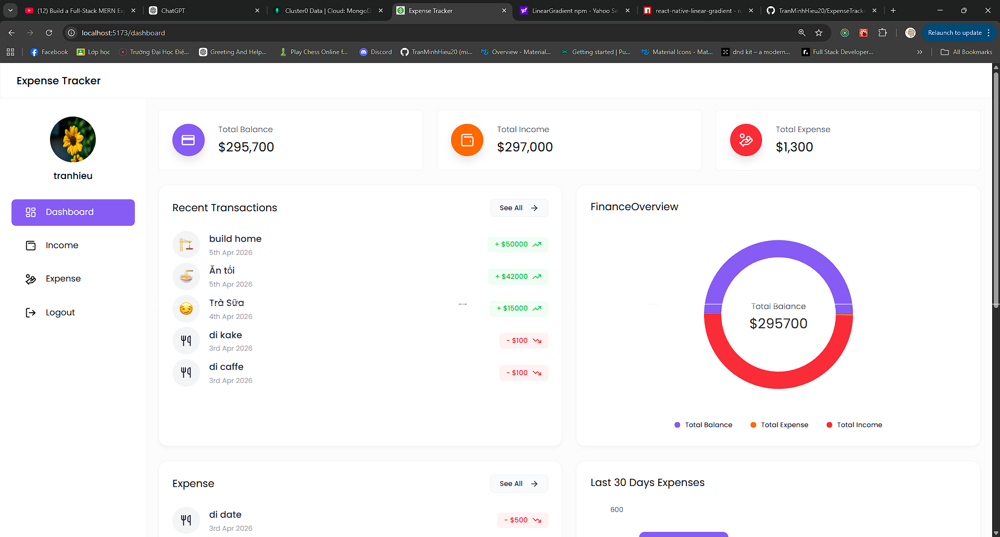

# 💰 Expense Tracker - Personal Finance Management App



> **🚀 Dùng thử ứng dụng trực tiếp (Live Demo):** [https://expensetracker-4hy2.onrender.com](https://expensetracker-4hy2.onrender.com/login)
> *(Lưu ý: Do sử dụng server miễn phí của Render, có thể mất từ 1-2 phút để server khởi động ở lần truy cập đầu tiên. Vui lòng kiên nhẫn!)*

**Expense Tracker** là một ứng dụng quản lý tài chính cá nhân toàn diện được xây dựng trên nền tảng MERN Stack (MongoDB, Express, React, Node.js). Ứng dụng giúp người dùng theo dõi thu nhập, chi tiêu hàng ngày một cách trực quan thông qua các biểu đồ phân tích và báo cáo chi tiết, từ đó tối ưu hóa thói quen quản lý tiền bạc.

---

## ✨ Tính năng nổi bật

- **📊 Dashboard Trực quan:** Cái nhìn tổng thể về Số dư (Balance), Tổng Thu nhập (Income) và Tổng Chi phí (Expense).
- **📈 Biểu đồ Phân tích:** 
  - Biểu đồ tròn (Pie Chart) phân tích tỷ trọng thu nhập và chi tiêu.
  - Biểu đồ vùng (Area Chart) theo dõi xu hướng giao dịch.
- **📝 Quản lý Giao dịch:** Thêm, xóa và phân loại các khoản thu/chi dễ dàng với các biểu tượng (icons) sinh động.
- **📥 Xuất Báo cáo:** Hỗ trợ xuất dữ liệu giao dịch ra file Excel (.xlsx) chuyên nghiệp.
- **🔐 Bảo mật:** Hệ thống xác thực người dùng sử dụng **JWT (JSON Web Token)** và mã hóa mật khẩu với **Bcrypt**.
- **🌐 Đăng nhập Google (Mới):** Đăng nhập và đăng ký nhanh chóng bằng tài khoản Google (OAuth 2.0).
- **📧 Khôi phục mật khẩu (Mới):** Yêu cầu gửi mã OTP qua Email (sử dụng Nodemailer) để đặt lại mật khẩu an toàn.
- **📱 Responsive Design:** Giao diện hiện đại, mượt mà trên mọi thiết bị từ Desktop đến Mobile nhờ Tailwind CSS.

---

## 🛠 Công nghệ sử dụng

### Frontend
- **React.js (Vite):** Thư viện UI hiện đại, tốc độ cao.
- **Tailwind CSS:** Framework CSS tối ưu cho giao diện Responsive.
- **Recharts:** Thư viện vẽ biểu đồ mạnh mẽ và linh hoạt.
- **Axios:** Xử lý các yêu cầu HTTP đến Backend.
- **Google OAuth:** `@react-oauth/google` để tích hợp nút đăng nhập Google.

### Backend
- **Node.js & Express:** Môi trường chạy server và framework xử lý API.
- **MongoDB & Mongoose:** Cơ sở dữ liệu NoSQL và thư viện quản lý schema.
- **JSON Web Token:** Cơ chế xác thực người dùng an toàn.
- **Nodemailer:** Thư viện gửi email tự động (dùng cho việc cấp lại mật khẩu).
- **Google Auth Library:** Xác thực ID Token từ Google gửi lên.
- **XLSX:** Thư viện tạo và xử lý file Excel.

---

## ⚙️ Hướng dẫn cài đặt (Dành cho người mới Clone)

Để chạy dự án này trên máy của bạn, hãy thực hiện các bước sau:

### 1. Clone dự án
```bash
git clone https://github.com/TranMinhHieu20/ExpenseTracker.git
cd ExpenseTracker
```

### 2. Cấu hình Backend
Di chuyển vào thư mục `backend` và cài đặt thư viện:
```bash
cd backend
npm install
```

Tạo file `.env` trong thư mục `backend` và điền các thông số sau:
```env
PORT=3000
MONGO_URI=your_mongodb_connection_string
JWT_SECRET=your_secret_key_for_jwt
CLIENT_URL=http://localhost:5173
NODE_ENV=development

# Google OAuth
GOOGLE_CLIENT_ID=your_google_oauth_client_id_here

# SMTP Config (Dành cho việc gửi email OTP)
SMTP_HOST=smtp.gmail.com
SMTP_PORT=587
SMTP_USER=your_gmail_address@gmail.com
SMTP_PASS=your_gmail_app_password
```
*(Lưu ý: `SMTP_PASS` là Mật khẩu ứng dụng (App Password) của Gmail, không phải mật khẩu đăng nhập thông thường).*

Chạy server backend:
```bash
npm run dev
```

### 3. Cấu hình Frontend
Mở một terminal khác, di chuyển vào thư mục `frontend` và cài đặt thư viện:
```bash
cd frontend
npm install
```

Tạo file `.env` trong thư mục `frontend` và cấu hình Google Client ID để nút Đăng nhập Google hoạt động:
```env
VITE_GOOGLE_CLIENT_ID=your_google_oauth_client_id_here
```

Chạy ứng dụng:
```bash
npm run dev
```

---

## 🔗 Danh mục API Chính

- **Xác thực (Auth):** 
  - `POST /api/v1/auth/register`, `POST /api/v1/auth/login`
  - `POST /api/v1/auth/google` (Đăng nhập Google)
  - `POST /api/v1/auth/forgot-password`, `POST /api/v1/auth/reset-password` (Khôi phục mật khẩu)
- **Dashboard:** `GET /api/v1/dashboard` (Lấy dữ liệu tổng hợp)
- **Thu nhập (Income):** `GET /api/v1/income/getIncomes`, `POST /api/v1/income/add`
- **Chi phí (Expense):** `GET /api/v1/expense/getExpenses`, `POST /api/v1/expense/add`

---

## 🤝 Đóng góp và Liên hệ

Nếu bạn có bất kỳ thắc mắc hoặc đóng góp nào cho dự án, vui lòng liên hệ:
- **Tác giả:** Trần Minh Hiếu
- **Github:** [TranMinhHieu20](https://github.com/TranMinhHieu20)
- **Email:** tranhieu200304@gmail.com

---
*Chúc bạn quản lý tài chính hiệu quả với Expense Tracker!*
